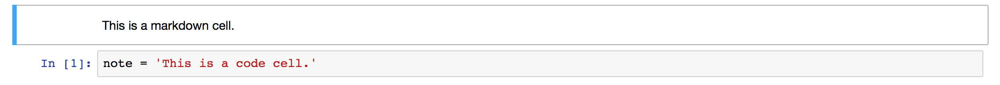

# Introduction to SageMaker

In this workshop, we'll work though several examples that demonstrate Amazon SageMaker's core components including notebook instances, hosted training, and hosted model endpoints.  Examples are divided into modules.  The examples that involve training machine learning models show how Amazon SageMaker can be applied in three fundamental categories of machine learning:  working with structured data, computer vision, and natural language processing.  

We'll also make use of some of Amazon SageMaker's built-in algorithms, specifically an AWS-optimized version of XGBoost and a deep learning-based image classification algorithm.  Built-in algorithms enable you to avoid spending time against algorithm/neural net design, provide conveniences such as reduced need for model tuning, and are meant to handle the scalability and reliability issues that arise when working with large datasets.  As a contrast, in one module we'll use a script defining our own deep learning model rather than a built-in algorithm.  Whether using your own models or built-in algorithms, all of Amazon SageMaker's features may be used in a similar way.  

To summarize, here are some of the key components and features of Amazon SageMaker demonstrated in this workshop:

- Using **Notebook Instances** for Exploratory Data Analysis and prototyping.
- **Local Mode Training** to confirm your code is working before moving on to full scale model training.
- **Hosted Training** for large scale model training.
- **Built-in algorithms** designed for web scale and kickstarting data science projects.
- **Script Mode**, which enables you to use your own model definitions and scripts similar to those outside SageMaker, with prebuilt machine learning containers.
- **Hosted Endpoints** for near real-time predictions.
- **Batch Transform** for asynchronous, large scale batch inference.

## Modules

This workshop is divided into multiple modules. After completing **Preliminaries**, complete the module **Creating a Notebook Instance** next.  You can complete the remaining modules in any order, EXCEPT the Videogame Sales module must be completed before the Extra Credit module. 

- Preliminaries

- Creating a Notebook Instance

- Structured Data Use Case:  Videogame Sales 

- Computer Vision Use Case:  Image Classification  

- Natural Language Processing Use Case:  Sentiment Analysis 

- Extra Credit:  Videogame Sales Using Scripts, the CLI and Console

## Preliminaries

- Be sure you have completed all of the Prerequisites listed in the [**main README**](../README.md). 

- **DOWNLOAD THIS REPOSITORY TO YOUR COMPUTER**. To do so:
  - Return to the home page of this GitHub repository or open it in another tab;
  - Click the green **Clone or download** button from the upper right of the main page of the repository, then **Download ZIP**.
  - Use the downloaded notebooks in the notebooks directory rather than other versions you might find inside your notebook instance or elsewhere; the downloaded versions are modified for use in workshops.  

If you are new to using Jupyter notebooks, read the next section, otherwise you may now skip ahead to the next module.

### Jupyter Notebooks:  A Brief Overview

Jupyter is an open-source web application that allows you to create and share documents that contain live code, equations, visualizations and narrative text. Uses include: data cleaning and transformation, numerical simulation, statistical modeling, data visualization, machine learning, and much more. With respect to code, it can be thought of as a web-based IDE that executes code on the server it is running on instead of locally. 

There are two main types of "cells" in a notebook:  code cells, and "markdown" cells with explanatory text. You will be running the code cells.  These are distinguished by having "In" next to them in the left margin next to the cell, and a greyish background.  Markdown cells lack "In" and have a white background. In the screenshot below, the upper cell is a markdown cell, while the lower cell is a code cell:

To run a code cell, simply click in it, then either click the **Run Cell** button in the notebook's toolbar, or use Control+Enter from your computer's keyboard. It may take a few seconds to a few minutes for a code cell to run. You can determine whether a cell is running by examining the `In[]:` indicator in the left margin next to each cell:  a cell will show `In [*]:` when running, and `In [a number]:` when complete.

Please run each code cell in order, and **only once**, to avoid repeated operations.  For example, running the same training job cell twice might create two training jobs, possibly exceeding your service limits.

## Creating a Notebook Instance

SageMaker provides hosted Jupyter notebooks that require no setup, so you can begin processing your training data sets immediately. With a few clicks in the SageMaker console, you can create a fully managed notebook instance, pre-loaded with useful libraries for machine learning. You need only add your data.

To create a SageMaker notebook instance for this workshop, follow the instructions at [**Creating a Notebook Instance**](../NotebookCreation), then return here to continue with the next module of the workshop.

## Structured Data Use Case:  Videogame Sales

In this module, we'll use Amazon SageMaker's built-in version of XGBoost to make predictions based on structured data related to the videogame industry.  Please go to the following link for this module:  [**Videogame Sales**](../modules/Video_Game_Sales.md).  Be sure to use the **downloaded** version of the applicable Jupyter notebook from this workshop repository.  

When you're finished, return here to move on to the next module.  

## Computer Vision Use Case:  Image Classification

This module uses Amazon SageMaker's built-in Image Classification algorithm.  Please go to the following link for this module:  [**Image Classification with Transfer Learning**](../modules/Image_Classification_Transfer_Learning.md).  Be sure to use the **downloaded** version of the applicable Jupyter notebook from this workshop repository.  

When you're finished, return here to move on to the next module.  

## Natural Language Processing Use Case:  Sentiment Analysis  

In contrast to the previous modules, which used some of Amazon SageMaker's built-in algorithms, in this module we'll use a deep learning framework within Amazon SageMaker with our own script defining our model.  Please go to the following link for this module:  [**Sentiment Analysis**](../modules/Sentiment_Analysis.md).  Be sure to use the **downloaded** version of the applicable Jupyter notebook from this workshop repository.  

When you're finished, return here and go on to the Extra Credit module or Cleanup Guide.  

## Extra Credit:  Videogame Sales Using Scripts, the CLI and Console 

The previous modules all use Jupyter notebooks to demonstrate the use of hosted training and hosted model endpoints in Amazon SageMaker.  However, in a typical machine learning pipeline, scripts are used to launch training jobs and deploy models, not notebooks.  Also, it is convenient to use the console for these tasks on an ad hoc basis without having to open notebooks or use scripts.

In this extra credit module, you will revisit the Videogame Sales example, but use Bash scripts to launch a training job and the Amazon SageMaker console to deploy the trained model.  Here are the steps you will need to take before beginning this module:

- Be sure you have completed the first module, **Structured Data Use Case:  Videogame Sales**.
- Copy the name of the default bucket created in the first cell of the Videogame Sales notebook from the first module.  It should look like:  `sagemaker-<region>-<your_account_id>`.
- Go to the following link and start at **Step 8 (Training Job)**:  [**Videogame Sales with the CLI and Console**](../modules/Video_Game_Sales_CLI_Console.md).  When the instructions ask for a bucket name, **USE THE BUCKET NAME YOU JUST COPIED.**

## Cleanup

To avoid charges for endpoints and other resources you might not need after the workshop, please refer to the [**Cleanup Guide**](../CleanupGuide).

