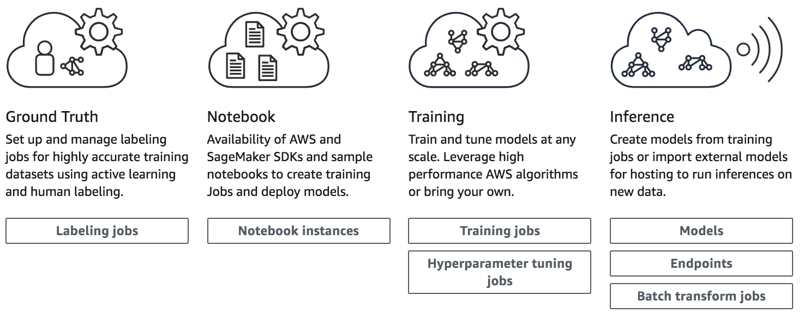

# Amazon SageMaker Workshops

Amazon SageMaker is a fully managed service that enables developers and data scientists to quickly and easily build, train, and deploy machine learning models at any scale. This repository contains a collection of workshops and other hands on content that will guide you through using the many features of Amazon SageMaker.  

You'll start by creating an Amazon SageMaker notebook instance with the requisite permissions. Depending on the workshop, you will then interact with Amazon SageMaker via sample Jupyter notebooks, the AWS CLI, the Amazon SageMaker console, or all three. 

**BEFORE attempting any of the workshops, please review the Prerequisites below and complete any actions that are required, especially those in the Permissions section.**

# Workshops

- [**Introduction to Amazon SageMaker**](Introduction) - This 100-200 level workshop demonstrates some of the key features of Amazon SageMaker.  It does so via a set of straightforward examples for common use cases including: working with structured data, natural language processing (sentiment analysis), and computer vision (image classification).  Content includes how to do exploratory data analysis in Amazon SageMaker notebook instances, run local and hosted training jobs, and get predictions using hosted model endpoints and batch transform jobs.

- [**TensorFlow in Amazon SageMaker**](TensorFlow) - In this 400 level workshop for TensorFlow users, various aspects of TensorFlow usage in Amazon SageMaker will be demonstrated.  In particular, TensorFlow will be applied to a natural language processing use case, a structured data use case, and a computer vision use case.  Relevant Amazon SageMaker features that will be demonstrated include:  prototyping with Local Mode training and endpoints, hosted training jobs for full-scale training, distributed training with parameter servers and Horovod, Automatic Model Tuning, batch inference, and hosted endpoints for real time inference, including low-cost inference acceleration using Amazon Elastic Inference.

- [**Simplify Workflows with Scripts, the CLI and Console**](Simplify-Workflows) - The focus of this 200+ level workshop is on simplifying Amazon SageMaker workflows using scripts, the AWS CLI, and the Amazon SageMaker console.  All of these are alternatives to using Jupyter notebooks as your interface to Amazon SageMaker; there is no necessity to use notebooks to leverage key Amazon SageMaker components such as hosted training and hosted model endpoints. In this workshop, you'll apply Amazon SageMaker built-in algorithms to a structured data use case, and a distributed training example showing different ways to set up nodes in a training cluster.

# Prerequisites

## AWS Account

**Permissions**: In order to complete this workshop you'll need an AWS Account, and an AWS IAM user in that account with at least full permissions to the following AWS services: 

- AWS IAM
- Amazon S3
- Amazon SageMaker
- AWS Cloud9
- Amazon EC2:  including P3, C5, and M5 instance types; to check your limits, see [Viewing Your Current Limits](https://docs.aws.amazon.com/AWSEC2/latest/UserGuide/ec2-resource-limits.html).  If you do not have at least the default limits specified in [the Amazon SageMaker Limits table](https://docs.aws.amazon.com/general/latest/gr/aws_service_limits.html#limits_sagemaker), please file a limit increase request via the AWS console.

**Use Your Own Account**: The code and instructions in this workshop assume only one student is using a given AWS account at a time. If you try sharing an account with another student, you'll run into naming conflicts for certain resources. You can work around these by appending a unique suffix to the resources that fail to create due to conflicts, but the instructions do not provide details on the changes required to make this work. Use a personal account or create a new AWS account for this workshop rather than using an organization’s account to ensure you have full access to the necessary services and to ensure you do not leave behind any resources from the workshop.

**Costs**: Some, but NOT all, of the resources you will launch as part of this workshop are eligible for the AWS free tier if your account is less than 12 months old. See the [AWS Free Tier page](https://aws.amazon.com/free/) for more details. An example of a resource that is **not** covered by the free tier is the Amazon SageMaker notebook instance type used in some workshops. To avoid charges for endpoints and other resources you might not need after you've finished a workshop, please refer to the [**Cleanup Guide**](./CleanupGuide). 

## AWS Region

Amazon SageMaker is not available in all AWS Regions at this time.  Accordingly, we recommend running this workshop in one of the following supported AWS Regions:  N. Virginia, Oregon, Ohio, or Ireland.

Once you've chosen a region, you should create all of the resources for this workshop there, including a new Amazon S3 bucket and a new SageMaker notebook instance. Make sure you select your region from the dropdown in the upper right corner of the AWS Console before getting started.

## Browser

We recommend you use the latest version of Chrome or Firefox to complete this workshop.

## AWS Command Line Interface

To complete certain workshop modules, you'll need the AWS Command Line Interface (CLI) and a Bash environment. You'll use the AWS CLI to interface with Amazon SageMaker and other AWS services. 

For these workshops, AWS Cloud9 is used to avoid problems that can arise configuring the CLI on your machine. AWS Cloud9 is a cloud-based integrated development environment (IDE) that lets you write, run, and debug your code with just a browser. It has the AWS CLI pre-installed so you don’t need to install files or configure your laptop to use the AWS CLI. For Cloud9 setup directions for these workshops, see [**Cloud9 Setup**](Cloud9). Do NOT attempt to use a locally installed AWS CLI during a live workshop because there is insufficient time during a live workshop to resolve related issues.

## Text Editor

For any workshop module that requires use of the AWS Command Line Interface (see above), you also will need a **plain text** editor for writing Bash scripts. Any editor that inserts Windows or other special characters potentially will cause scripts to fail. AWS Cloud9 includes a text editor. 

# License & Contributing

The contents of this workshop are licensed under the [Apache 2.0 License](./LICENSE). 
If you are interested in contributing to this project, please see the [Contributing Guidelines](./contributing/CONTRIBUTING.md).  In connection with contributing, also review the [Code of Conduct](./contributing/CODE_OF_CONDUCT.md).

