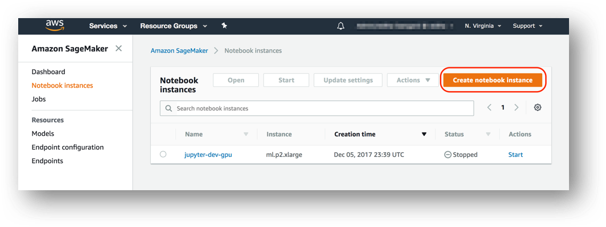
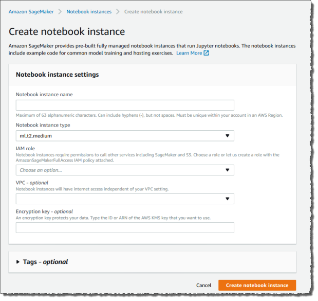
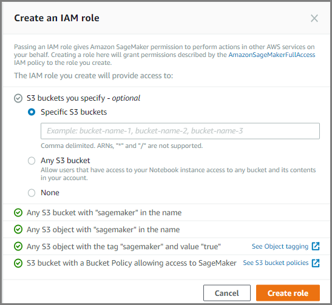
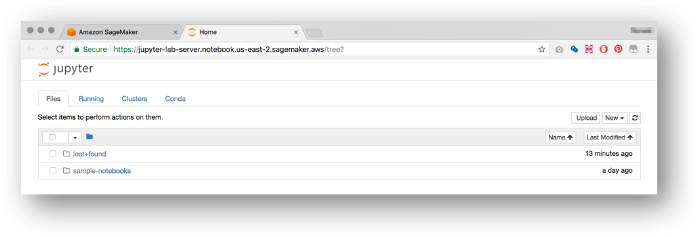

# Amazon SageMaker Workshop

Amazon SageMaker is a fully-managed service that enables developers and data scientists to quickly and easily build, train, and deploy machine learning models at any scale. In this workshop, you'll create a SageMaker notebook instance and work through sample Jupyter notebooks that demonstrate some of the many features of SageMaker.  For example, you'll create model training jobs using SageMaker's hosted training feature, and create endpoints to serve predictions from your models using SageMaker's hosted endpoint feature. Along the way you'll see how machine learning can be applied to both structured data (e.g. from CSV flat files) and unstructured data (e.g. images).  


## Prerequisites

### AWS Account

In order to complete this workshop you'll need an AWS Account with access to create AWS IAM, S3 and SageMaker resources. The code and instructions in this workshop assume only one student is using a given AWS account at a time. If you try sharing an account with another student, you'll run into naming conflicts for certain resources. You can work around these by appending a unique suffix to the resources that fail to create due to conflicts, but the instructions do not provide details on the changes required to make this work.

Some of the resources you will launch as part of this workshop are eligible for the AWS free tier if your account is less than 12 months old. See the [AWS Free Tier page](https://aws.amazon.com/free/) for more details.

### AWS Region

SageMaker is not available in all AWS Regions at this time.  Accordingly, we recommend running this workshop in one of the following supported AWS Regions:  N. Virginia, Oregon, Ohio, or Ireland.

Once you've chosen a region, you should create all of the resources for this workshop there, including a new Amazon S3 bucket and a new SageMaker notebook instance. Make sure you select your region from the dropdown in the upper right corner of the AWS Console before getting started.


### Browser

We recommend you use the latest version of Chrome or Firefox to complete this workshop.

## Modules

This workshop is divided into multiple modules. Module 1 must be completed first, followed by Module 2.  You can complete the other modules (Modules 3 and 4) in any order.  

1. Creating a Notebook Instance
2. Video Game Sales Notebook
3. Distributed Training with TensorFlow Notebook
4. Image Classification Notebook 

Be patient as you work your way through the notebook-based modules. After you run a cell in a notebook, it may take several seconds for the code to show results. For the cells that start training jobs, it may take several minutes. In particular, the last two modules have training jobs that may last up to 10 minutes.  

After you have completed the workshop, you can delete all of the resources that were created by following the Cleanup Guide provided with this lab guide. 

## Module 1:  Creating a Notebook Instance

In this module we'll start by creating an Amazon S3 bucket that will be used throughout the workshop.  We'll then create a SageMaker notebook instance, which we will use to run the other workshop modules.

### 1. Create a S3 Bucket

SageMaker typically uses S3 as storage for data and model artifacts.  In this step you'll create a S3 bucket for this purpose. To begin, sign into the AWS Management Console, https://console.aws.amazon.com/.

#### High-Level Instructions

Use the console or AWS CLI to create an Amazon S3 bucket. Keep in mind that your bucket's name must be globally unique across all regions and customers. We recommend using a name like `smworkshop-firstname-lastname`. If you get an error that your bucket name already exists, try adding additional numbers or characters until you find an unused name.

<details>
<summary><strong>Step-by-step instructions (expand for details)</strong></summary><p>

1. In the AWS Management Console, choose **Services** then select **S3** under Storage.

1. Choose **+Create Bucket**

1. Provide a globally unique name for your bucket such as `smworkshop-firstname-lastname`.

1. Select the Region you've chosen to use for this workshop from the dropdown.

1. Choose **Create** in the lower left of the dialog without selecting a bucket to copy settings from.

</p></details>

### 2. Launching the Notebook Instance

1. In the upper-right corner of the AWS Management Console, confirm you are in the desired AWS region. Select N. Virginia, Oregon, Ohio, or Ireland.

2. Click on Amazon SageMaker from the list of all services.  This will bring you to the Amazon SageMaker console homepage.


3. To create a new notebook instance, go to **Notebook instances**, and click the **Create notebook instance** button at the top of the browser window.



4. Type [First Name]-[Last Name]-workshop into the **Notebook instance name** text box, and select ml.m4.xlarge for the **Notebook instance type**.



5. For IAM role, choose **Create a new role**, and in the resulting pop-up modal, select **Specific S3 buckets** under **S3 Buckets you specify – optional**. In the text field, paste the name of the S3 bucket you created above.  It should look similar to ```smworkshop-john-smith```. Click **Create role**.



6. You will be taken back to the Create Notebook instance page.  Click **Create notebook instance**.

### 3. Accessing the Notebook Instance

1. Wait for the server status to change to **InService**. This will take a few minutes.


2. Click **Open**. You will now see the Jupyter homepage for your notebook instance.




## Module 2:  Video Game Sales Notebook

In this module, we'll work our way through an example Jupyter notebook that demonstrates how to use an Amazon-provided algorithm in SageMaker. More specifically, we'll use SageMaker's version of XGBoost, a popular and efficient open-source implementation of the gradient boosted trees algorithm. Gradient boosting is a supervised learning algorithm that attempts to predict a target variable by combining the estimates of a set of simpler, weaker models. XGBoost has done remarkably well in machine learning competitions because it robustly handles a wide variety of data types, relationships, and distributions. It often is a useful, go-to algorithm in working with structured data, such as data that might be found in relational databases and flat files. 

To begin, follow these steps:

1. Download this repository to your computer by clicking the green **Clone or download**  button from the upper right of this page, then **Download ZIP**.
2. In your notebook instance, click the **New** button on the right and select **Folder**.  
3. Click the checkbox next to your new folder, click the **Rename** button above in the menu bar, and give the folder a name such as 'video-game-sales'.
4. Click the folder to enter it.
5. To upload the notebook, click the **Upload** button on the right, then in the file selection popup, select the file 'video-game-sales-xgboost.ipynb' from the folder on your computer where you downloaded this GitHub repository. Then click the blue **Upload** button that appears in the notebook next to the file name.
6. You are now ready to begin the notebook:  click the notebook's file name to open it.
7. In the ```bucket = '<your_s3_bucket_name_here>'``` code line, paste the name of the S3 bucket you created in Module 1 to replace ```<your_s3_bucket_name_here>```.  The code line should now read similar to ```bucket = 'smworkshop-john-smith'```.  Do NOT paste the entire path (s3://.......), just the bucket name.  
8. If you are familiar with Jupyter notebooks, you can skip this step.  Otherwise, please expand the instructions below.

<details>
<summary><strong>Jupyter notebook instructions (expand for details)</strong></summary><p>

1. Jupyter notebooks tell a story by combining explanatory text and code. There are two types of "cells" in a notebook:  code cells, and "markdown" cells with explanatory text.  

1. You will be running the code cells.  These are distinguished by having "In" next to them in the left margin next to the cell, and a greyish background.  Markdown cells lack "In" and have a white background.

1. To run a code cell, simply click in it, then either click the **Run Cell** button in the notebook's toolbar, or use Control+Enter from your computer's keyboard.  

1. It may take a few seconds to a few minutes for a code cell to run.  Please run each code cell in order, and only once, to avoid repeated operations.  For example, running the same training job cell twice might create two training jobs, possibly exceeding your service limits.

</p></details>

<p><strong>NOTE:  training the model for this example typically takes about 5 minutes.</strong></p>


## Module 3:  Distributed Training with TensorFlow Notebook

In this module we will be using images of handwritten digits from the [MNIST Database](http://yann.lecun.com/exdb/mnist/) to demonstrate how to perform distributed training using SageMaker. Using a convolutional neural network model based on the [TensorFlow MNIST Example](https://github.com/tensorflow/models/tree/master/official/mnist), we will demonstrate how to use a Jupyter notebook and the [SageMaker Python SDK](https://github.com/aws/sagemaker-python-sdk) to create your own script to pre-process data, train a model, create a SageMaker hosted endpoint, and make predictions against this endpoint. The model will predict what the handwritten digit is in the image presented for prediction. Besides demonstrating a "bring your own script" for TensorFlow use case, the example also showcases how easy it is to set up a cluster of multiple instances for model training in SageMaker.

1. In your notebook instance, click the **New** button on the right and select **Folder**.
2. Click the checkbox next to your new folder, click the **Rename** button above in the menu bar, and give the folder a name such as 'tensorflow-distributed'.
3. Click the folder to enter it.
4. To upload the notebook, click the **Upload** button on the right, then in the file selection popup, select the file 'TensorFlow_Distributed_MNIST.ipynb' from the folder on your computer where you downloaded this GitHub repository. Then click the blue **Upload** button that appears in the notebook next to the file name.
5. You are now ready to begin the notebook:  click the notebook's file name to open it, then follow the directions in the notebook.

<p><strong>NOTE:  training the model for this example typically takes about 8 minutes.</strong></p>

## Module 4:  Image Classification Notebook

For this module, we'll work with an image classification example notebook. In particular, we'll use the Amazon-provided image classification algorithm, which is a supervised learning algorithm that takes an image as input and classifies it into one of multiple output categories. It uses a convolutional neural network (ResNet) that can be trained from scratch, or trained using transfer learning when a large number of training images are not available. Even if you don't have experience with neural networks or image classification, SageMaker's image classification algorithm makes the technology easy to use, with no need to design and set up your own neural network.  

Follow these steps:

1. In your notebook instance, click the **New** button on the right and select **Folder**.  
2. Click the checkbox next to your new folder, click the **Rename** button above in the menu bar, and give the folder a name such as 'image-classification'.
3. Click the folder to enter it.
4. To upload the notebook, click the **Upload** button on the right, then in the file selection popup, select the file 'Image-classification-transfer-learning.ipynb' from the folder on your computer where you downloaded this GitHub repository. Then click the blue **Upload** button that appears in the notebook next to the file name.
5. You are now ready to begin the notebook:  click the notebook's file name to open it, then follow the directions in the notebook.

<p><strong>NOTE:  training the model for this example typically takes about 10 minutes.</strong> However, keep in mind that this is relatively short because transfer learning is used rather than training from scratch, which could take many hours.</p>

## Cleanup Guide

To avoid charges for resources you no longer need when you're done with this workshop, you can delete them or, in the case of your notebook instance, stop them.  Here are the resources you should consider:

- Endpoints:  these are the clusters of one or more instances serving inferences from your models. If you did not delete them from within the notebooks, you can delete them via the SageMaker console.  To do so, click the **Endpoints** link in the left panel.  Then, for each endpoint, click the radio button next to it, then select **Delete** from the **Actions** drop down menu. You can follow a similar procedure to delete the related Models and Endpoint configurations.

- Notebook instance:  you have two options if you do not want to keep the notebook instance running. If you would like to save it for later, you can stop rather than deleting it. To delete it, click the **Notebook instances** link in the left panel. Next, click the radio button next to the notebook instance created for this workshop, then select **Delete** from the **Actions** drop down menu. To simply stop it instead, just click the **Stop** link.  After it is stopped, you can start it again by clicking the **Start** link.  Keep in mind that if you stop rather than delete it, you will be charged for the storage associated with it.  

## License

The contents of this workshop are licensed under the Apache 2.0 License. 
