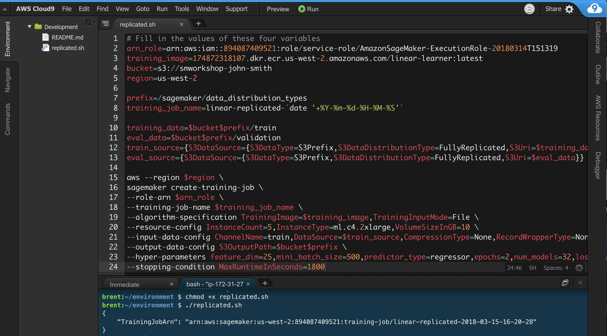
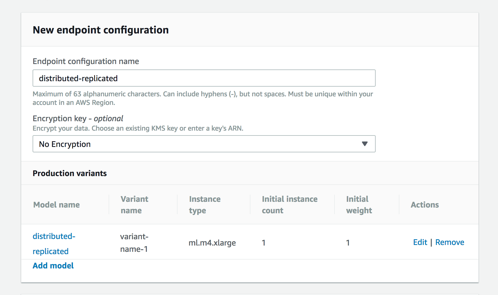

# Distributed Training with SageMaker's Built-in Algorithms

## Introduction

Amazon SageMaker provides high-performance, scalable machine learning algorithms optimized for speed, scale, and accuracy, and designed to run on extremely large training datasets. Based on the type of learning that you are undertaking, you can choose from either supervised algorithms (e.g. linear/logistic regression or classification), or unsupervised algorithms (e.g. k-means clustering). Besides general purpose algorithms, Amazon SageMaker's set of built-in algorithms also includes specific-purpose algorithms suited for tasks in domains such as natural language processing and computer vision.  

Amazon SageMaker's built-in algorithms are re-envisioned from the ground up, specifically for large training data sets. Most algorithms available elsewhere rely on being able to load files or the entire data set into memory, which doesn’t work for very large datasets. Even algorithms that don’t do this need all of the data downloaded before training starts, instead of streaming the data in and processing it as it comes in. And lastly, large training data sets can cause some algorithms available elsewhere to give up - in some cases, with training data sets as small as a few gigabytes.

To summarize, there are many reasons to use Amazon SageMaker’s built-in algorithms instead of "bringing your own" (BYO) algorithm if the built-in algorithms fit your use case:  

- With BYO, time/cost must be spent on design (e.g. of a neural net).
- With BYO, you must solve the problems of scalability and reliability for large data sets. 
- Built-in algorithms take care of these concerns.
- Built-in algorithms also provide many conveniences such as reduced need for external hyperparameter optimization, efficient data loading, etc.  
- Faster training, and faster inference with smaller models produced by some built-in algorithms.
- Even if you’re doing BYO, built-in algorithms may be helpful at some point in the machine learning pipeline, such as the PCA built-in algorithm for dimensionality reduction.

## Parallelized Data Distribution

Amazon SageMaker makes it easy to train machine learning models across a cluster containing a large number of machines. This a non-trivial process, but Amazon SageMaker's built-in algorithms and pre-built deep learning containers (for TensorFlow, PyTorch, MXNet and Chainer) hide most of the complexity from you. Nevertheless, there are decisions about how to structure data that will have implications regarding how the distributed training is carried out. 

In this module, we will learn about how to take full advantage of distributed training clusters when using one of Amazon SageMaker's built-in algorithms. This module also shows how to use SageMaker's built-in algorithms via hosted Jupyter notebooks, the AWS CLI, and the Amazon SageMaker console.

1. **Exploratory Data Analysis**:  For this part of the module, we'll be using an Amazon SageMaker notebook instance to explore and visualize a data set.  Be sure you have downloaded this GitHub repository as specified in **Preliminaries** before you start.  Next, in your notebook instance, click the **New** button on the right and select **Folder**.  

2. Click the checkbox next to your new folder, click the **Rename** button above in the menu bar, and give the folder a name such as 'distributed-data'.

3. Click the folder to enter it.

4. To upload the notebook for this module, click the **Upload** button on the right. Then in the file selection popup, select the file 'data_distribution_types.ipynb' from the notebooks subdirectory in the folder on your computer where you downloaded this GitHub repository. Click the blue **Upload** button that appears to the right of the notebook's file name.

5. You are now ready to begin the notebook:  click the notebook's file name to open it.

6. In the ```bucket = '<your_s3_bucket_name_here>'``` code line, paste the name of the S3 bucket you created in **Creating a Notebook Instance** to replace ```<your_s3_bucket_name_here>```.  The code line should now read similar to ```bucket = 'smworkshop-john-smith'```.  Do NOT paste the entire path (s3://.......), just the bucket name.  

- In this workshop, you also will be accessing a S3 bucket that holds data from one of the AWS Public Data Sets.

- If you followed the [**Creating a Notebook Instance**](../NotebookCreation) module to create your notebook instance, you should be able to access this S3 bucket. Otherwise, if you are using your own notebook instance created elsewhere, you may need to modify the associated IAM role to add permissions for `s3:ListBucket` for `arn:aws:s3:::gdelt-open-data`, and `s3:GetObject` for `arn:aws:s3:::gdelt-open-data/*`.

7. Follow the directions in the notebook.  When it is time to set up a training job, return from the notebook to these instructions.  

8. **First Training Job**:  Now that we have our data in S3, we can begin training. We'll use Amazon SageMaker's built-in Linear Learner algorithm. Since the focus of this module is data distribution to a training cluster, we'll fit two models in order to compare data distribution types. To understand the different types, please read the following:

- In the first job, we'll use `FullyReplicated` for our `train` channel. This will pass every file in our input S3 location to every machine (in this case we're using 5 machines). 

- In the second job, we'll use `ShardedByS3Key` for the `train` channel (note that we'll keep `FullyReplicated` for the validation channel). So, for the training data, we'll pass each S3 object to a separate machine. Since we have 5 files (one for each year), we'll train on 5 machines, meaning each machine will get a year's worth of records.

- We'll be using the AWS CLI and Bash scripts to run the training jobs. Using the AWS CLI and scripts is an excellent way to automate machine learning pipelines and repetitive tasks, such as periodic training jobs. If you haven't done so already, please set up and open your Cloud9 environment now as described in [**Cloud9 Setup**](../Cloud9). Below is a screenshot of what your Cloud9 environment should look like as you create the first script below and run the related commands.  Step-by-step instructions follow.



9. Create a text file named `replicated.sh`. If you haven't done so already, open a terminal/command window that supports Bash to enter commands. In the terminal window, change to the directory in which you created the file (if you're not already there), then run the following command:

```
chmod +x replicated.sh
```

10.  Paste the bash script below into the `replicated.sh` file, and then change the text in the angle brackets (< >) as follows.  Do NOT put quotes around the values you insert, or retain the brackets.  

- arn_role:  To get the value for this variable, go to the Amazon SageMaker console, click **Notebook instances** in the left pane, then in the 'Notebook instances' table, click the name of the instance you created for this workshop.  In the **Notebook instance settings** section, look for the 'IAM role ARN' value, and copy its text. It should look like the following:  `arn:aws:iam::1234567890:role/service-role/AmazonSageMaker-ExecutionRole-20171211T211964`.

- training_image:  select one of the following, depending on the AWS Region where you are running this workshop.
  - N. Virginia:  382416733822.dkr.ecr.us-east-1.amazonaws.com/linear-learner:latest
  - Oregon:  174872318107.dkr.ecr.us-west-2.amazonaws.com/linear-learner:latest
  - Ohio:  404615174143.dkr.ecr.us-east-2.amazonaws.com/linear-learner:latest
  - Ireland:  438346466558.dkr.ecr.eu-west-1.amazonaws.com/linear-learner:latest
   
- bucket:  the name of the S3 bucket you used in your notebook.  It should look like:  `s3://smworkshop-john-smith`.

- region:  the region code for the region where you are running this workshop, either `us-east-1` for N. Virginia, `us-west-2` for Oregon, `us-east-2` for Ohio, or `eu-west-1` for Ireland.

```
# Fill in the values of these four variables
arn_role=<arn-of-your-notebook-role>
training_image=<training-image-for-region>
bucket=<name-of-your-s3-bucket>
region=<your-region>

prefix=/sagemaker/data_distribution_types
training_job_name=linear-replicated-`date '+%Y-%m-%d-%H-%M-%S'`

training_data=$bucket$prefix/train
eval_data=$bucket$prefix/validation
train_source={S3DataSource={S3DataType=S3Prefix,S3DataDistributionType=FullyReplicated,S3Uri=$training_data}}
eval_source={S3DataSource={S3DataType=S3Prefix,S3DataDistributionType=FullyReplicated,S3Uri=$eval_data}}

aws --region $region \
sagemaker create-training-job \
--role-arn $arn_role \
--training-job-name $training_job_name \
--algorithm-specification TrainingImage=$training_image,TrainingInputMode=File \
--resource-config InstanceCount=5,InstanceType=ml.c4.2xlarge,VolumeSizeInGB=10 \
--input-data-config ChannelName=train,DataSource=$train_source,CompressionType=None,RecordWrapperType=None ChannelName=validation,DataSource=$eval_source,CompressionType=None,RecordWrapperType=None \
--output-data-config S3OutputPath=$bucket$prefix \
--hyper-parameters feature_dim=25,mini_batch_size=500,predictor_type=regressor,epochs=2,num_models=32,loss=absolute_loss \
--stopping-condition MaxRuntimeInSeconds=1800

```

11.  Save your file, then in your terminal window, run the following command to start the training job. Total job duration may last up to about 10 minutes, including time for setting up the training cluster. In case the training job encounters problems and is stuck, you can set a stopping condition that times out, in this case after a half hour. Now, since you can run another job concurrently with this one, move onto the next step after you start this job.

```
./replicated.sh  
```

12. **Second Training Job**:  For our next training job with the `ShardedByS3Key` distribution type, please create a text file named `sharded.sh`.  then run the following command in your terminal window:

```
chmod +x sharded.sh
```

13.  Paste the bash script below into the `sharded.sh` file, and then change the text in the angle brackets (< >) as follows.  Do NOT put quotes around the values you insert, or retain the brackets. All four values to change are the same as the values you changed for the previous script; they are noted again below for your ease of reference.

- arn_role:  same as for the previous script. It should look like the following:  `arn:aws:iam::1234567890:role/service-role/AmazonSageMaker-ExecutionRole-20171211T211964`.

- training_image:  same as the previous script; the image depends on the AWS Region where you are running this workshop.  They are shown again here for convenience:  
  - N. Virginia:  382416733822.dkr.ecr.us-east-1.amazonaws.com/linear-learner:latest
  - Oregon:  174872318107.dkr.ecr.us-west-2.amazonaws.com/linear-learner:latest
  - Ohio:  404615174143.dkr.ecr.us-east-2.amazonaws.com/linear-learner:latest
  - Ireland:  438346466558.dkr.ecr.eu-west-1.amazonaws.com/linear-learner:latest
   
- bucket:  same as for the previous script.  It should look like:  `s3://smworkshop-john-smith`.

- region:  the region code for the region where you are running this workshop, either `us-east-1` for N. Virginia, `us-west-2` for Oregon, `us-east-2` for Ohio, or `eu-west-1` for Ireland.

```
# Fill in the values of these four variables
arn_role=<arn-of-your-notebook-role>
training_image=<training-image-for-region>
bucket=<name-of-your-s3-bucket>
region=<your-region>

prefix=/sagemaker/data_distribution_types
training_job_name=linear-sharded-`date '+%Y-%m-%d-%H-%M-%S'`

training_data=$bucket$prefix/train
eval_data=$bucket$prefix/validation
train_source={S3DataSource={S3DataType=S3Prefix,S3DataDistributionType=ShardedByS3Key,S3Uri=$training_data}}
eval_source={S3DataSource={S3DataType=S3Prefix,S3DataDistributionType=FullyReplicated,S3Uri=$eval_data}}

aws --region $region \
sagemaker create-training-job \
--role-arn $arn_role \
--training-job-name $training_job_name \
--algorithm-specification TrainingImage=$training_image,TrainingInputMode=File \
--resource-config InstanceCount=5,InstanceType=ml.c4.2xlarge,VolumeSizeInGB=10 \
--input-data-config ChannelName=train,DataSource=$train_source,CompressionType=None,RecordWrapperType=None ChannelName=validation,DataSource=$eval_source,CompressionType=None,RecordWrapperType=None \
--output-data-config S3OutputPath=$bucket$prefix \
--hyper-parameters feature_dim=25,mini_batch_size=500,predictor_type=regressor,epochs=2,num_models=32,loss=absolute_loss \
--stopping-condition MaxRuntimeInSeconds=1800

```

14.  Save your file, then in your terminal window, run the following command to start your second training job now, there is no need to wait for the first training job to complete:

```
./sharded.sh 
```

15.  In the Amazon SageMaker console, click **Jobs** in the left panel to check the status of the training jobs, which run concurrently.  When they are complete, their **Status** column will change from InProgress to Complete.  As a reminder, duration of these jobs can last up to about 10 minutes, including time for setting up the training cluster, as shown in the **Duration** column of the **Jobs** table.

- To check the actual training time (not including cluster setup) for each job when both are complete, click the training job name in the jobs table, then examine the **Training duration** listed at the top right under **Job Settings**.  **Training duration** does not include the time related to cluster setup. As we can see, and might expect, the sharded distribution type trained substantially faster than the fully replicated type. This is a key differentiator to consider when preparing data and picking the distribution type.

16.  **Amazon SageMaker Model Creation**:  Now that we've trained our machine learning models, we'll want to make predictions by setting up a hosted endpoint for them. The first step in doing that is to create a SageMaker model object that wraps the actual model artifact from training. To create the model object, we will point to the model.tar.gz that came from training and the inference code container, then create the hosting model object.  We'll do this twice, once for each model we trained earlier. Here are the steps to do this via the Amazon SageMaker console (see screenshot below for an example of all relevant fields filled in for the Oregon AWS Region):

- In the left pane of the SageMaker console home page, right click the **Models** link and open it in another tab of your browser.  Click the **Create Model** button at the upper right above the 'Models' table.

- For the 'Model name' field under **Model Settings**, enter `distributed-replicated`.  

- For the 'Location of inference code image' field under **Primary Container**, enter the name of the same Docker image you specified previously for the region where you're running this workshop. For ease of reference, here are the image names again:

  - N. Virginia:  382416733822.dkr.ecr.us-east-1.amazonaws.com/linear-learner:latest
  - Oregon:  174872318107.dkr.ecr.us-west-2.amazonaws.com/linear-learner:latest
  - Ohio:  404615174143.dkr.ecr.us-east-2.amazonaws.com/linear-learner:latest
  - Ireland:  438346466558.dkr.ecr.eu-west-1.amazonaws.com/linear-learner:latest

- For the 'Location of model artifacts' field under **Primary Container**, enter the path to the output of your replicated training job.  To find the path, go back to your first browser tab, click **Jobs** in the left pane, then find and click the replicated job name, which will look like `linear-replicated-<date>`.  Scroll down to the **Outputs** section, then copy the path under 'S3 model artifact'.  Paste the path in the field; it should look like `s3://sagemaker-projects-pdx/sagemaker/data_distribution_types/linear-replicated-2018-03-11-18-13-13/output/model.tar.gz`.  

- Click **Create model** at the bottom of the page.

- Repeat the above steps for the sharded training job model, except:  for 'Model name', enter `distributed-sharded`, and for 'Location of model artifacts', enter the path for the sharded training job model artifact.  


17.  **Endpoint Configuration**:  Once we've setup our models, we can configure what our hosting endpoints should be. Here we specify the EC2 instance type to use for hosting, the initial number of instances, and our hosting model name.  Again, we'll do this twice, once for each model we trained earlier. Here are the steps to do this via the SageMaker console (see screenshot below for an example of all relevant fields filled in for the Oregon AWS Region):

- In the left pane of the SageMaker console, click **Endpoint configuration**.  Click the **Create endpoint configuration** button at the upper right above the 'Endpoint configuration' table.

- For the 'Endpoint configuration name' field under **New endpoint configuration**, enter `distributed-replicated`.  

- Under **Production variants**, click **Add model**.  From the **Add model** popup, select the `distributed-replicated` model you created earlier, and click **Save**.  Then click **Create endpoint configuration** at the bottom of the page.

- Repeat the above steps for the sharded training job model, except:  for 'Endpoint configuration name', enter `distributed-sharded`, and for the **Add model** popup, select the `distributed-sharded` model.  



18.  **Endpoint Creation**:  Now that we've specified how our endpoints should be configured, we can create them.  For this final step in the process of settng up endpoints, we'll once again use the SageMaker console to do so (see screenshot below for an example of all relevant fields filled in for the Oregon AWS Region):

- In the left pane of the Amazon SageMaker console, click **Endpoints**.  Click the **Create endpoint** button at the upper right above the 'Endpoints' table.

- For the 'Endpoint name' field under **Endpoint**, enter `distributed-replicated`. 

- Under **Attach endpoint configuration**, leave 'Use an existing endpoint configuration' selected, then under **Endpoint configuration**, select `distributed-replicated` from the table, then click **Select endpoint configuration** at the bottom of the table.  Then click **Create endpoint** at the bottom of the page.

- Repeat the above steps, except:  for 'Endpoint name', enter `distributed-sharded`, and for the **Endpoint configuration** table, select the `distributed-sharded` endpoint configuration. 

- In the **Endpoints** table, refer to the 'Status' column, and wait for both endpoints to change from 'Creating' to 'InService' before proceeding to the next step. It will take several minutes for endpoint creation, possibly as long as ten minutes.  


19.  **Evaluate**:  To compare predictions from our two models, let's return to the notebook we used earlier.  When you are finished, return here and proceed to the next section.  

### Conclusion & Extensions

In this module, we ran a regression on a relatively artificial example, and we skipped some pre-processing steps along the way (like potentially transforming or winsorizing our target variable, looking for interations in our features, etc.). But the main point was to highlight the difference in training time and accuracy of a model trained through two different distribution methods.

Overall, sharding data into separate files and sending them to separate training nodes will run faster, but may produce lower accuracy than a model that replicates the data across all nodes. Naturally, this can be influenced by training the sharded model longer, with more epochs. And it should be noted that we trained with a very small number of epochs to highlight this difference.

Different algorithms can be expected to show variation in which distribution mechanism is most effective at achieving optimal compute spend per point of model accuracy. The message remains the same though, that the process of finding the right distribution type is another experiment in optimizing model training times.


