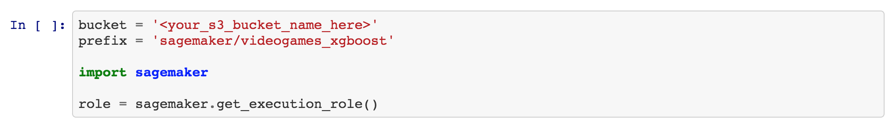
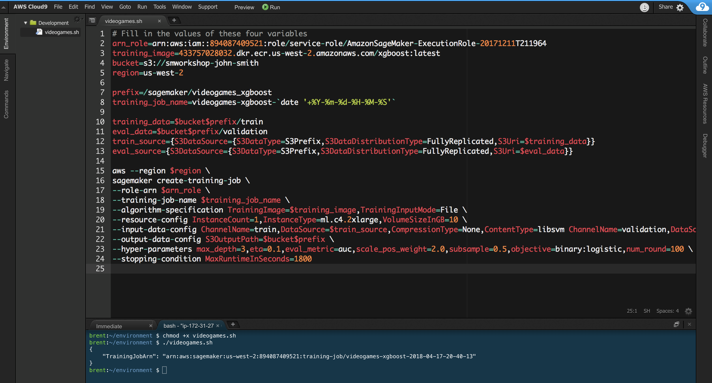
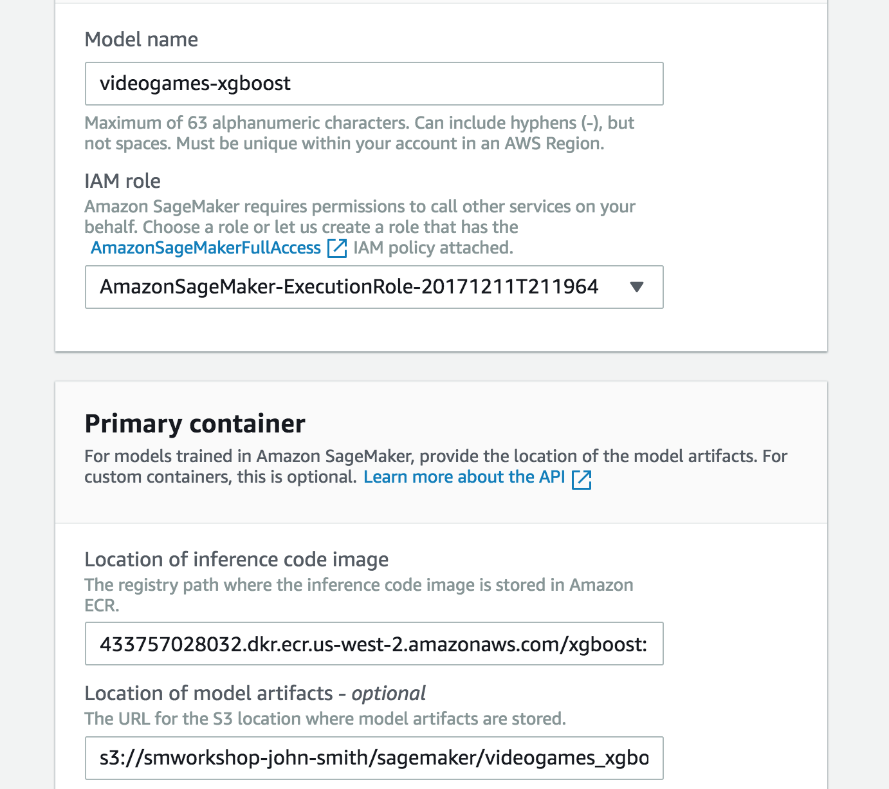
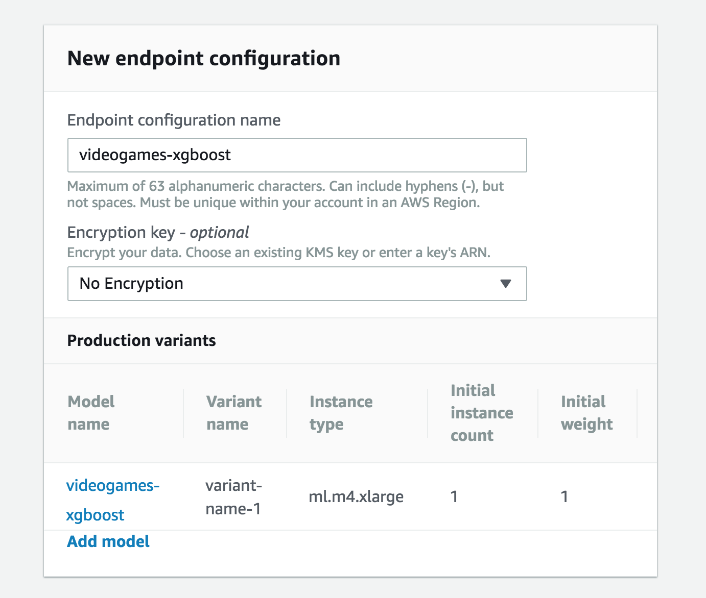
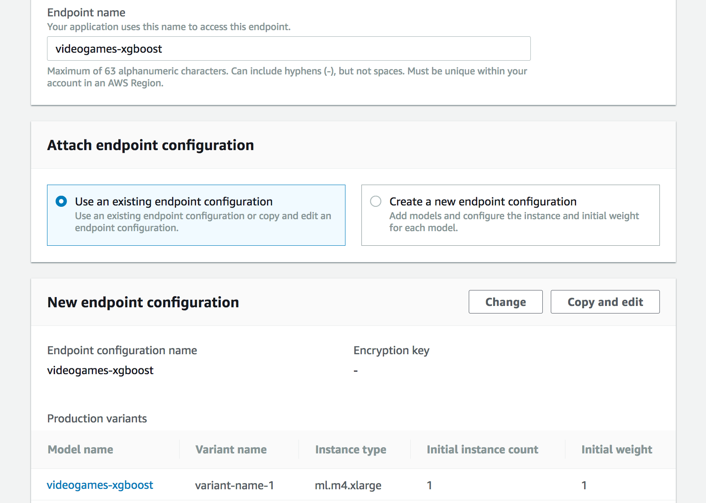
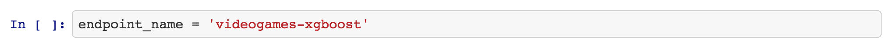

## Videogame Sales with the CLI and Console


In this module, we'll work our way through an example that demonstrates how to use a built-in algorithm in SageMaker. More specifically, we'll use Amazon SageMaker's version of XGBoost, a popular and efficient open-source implementation of the gradient boosted trees algorithm. 

A gradient boosted trees algorithm attempts to predict a target variable by combining the estimates of a set of simpler, weaker models. XGBoost has done remarkably well in machine learning competitions because it robustly handles a wide variety of data types, relationships, and distributions. It often is a useful, go-to algorithm in working with structured data, such as data that might be found in relational databases and flat files. 

This module also shows how to use Amazon SageMaker's built-in algorithms via hosted Jupyter notebooks, the AWS CLI, and the Amazon SageMaker console.  To proceed, follow these steps:

1. **Exploratory Data Analysis**:  For this part of the module, we'll be using a SageMaker notebook instance to explore and visualize a data set.  Be sure you have downloaded this GitHub repository as specified in **Preliminaries** before you start.  Next, in your notebook instance, click the **New** button on the right and select **Folder**.  

2. Click the checkbox next to your new folder, click the **Rename** button above in the menu bar, and give the folder a name such as 'videogame-sales-cli-console'.

3. Click the folder to enter it.

4. To upload the notebook for this module, click the **Upload** button on the right. Then in the file selection popup, select the file 'videogame-sales-cli-console.ipynb' from the notebooks subdirectory in the folder on your computer where you downloaded this GitHub repository. DO NOT USE THE DIFFERNT NOTEBOOK 'videogame-sales' (it does not use the CLI or console).  Click the blue **Upload** button that appears to the right of the notebook's file name.

5. You are now ready to begin the notebook:  click the notebook's file name to open it.

6. In the ```bucket = '<your_s3_bucket_name_here>'``` code line, paste the name of the S3 bucket you created in Module 1 to replace ```<your_s3_bucket_name_here>```.  The code line should now read similar to ```bucket = 'smworkshop-john-smith'```.  Do NOT paste the entire path (s3://.......), just the bucket name.  

7. Follow the directions in the notebook.  Begin by reading the **Background** section, then run the cells in the **Setup** and **Data** sections; the first cell to run is pictured below.  When it is time to set up a training job, return from the notebook to these instructions.  



8. **Training Job**:  The next few steps will be performed outside the notebook, but leave the notebook open for now because you'll be returning to it later. Now that we have our data in S3, we can begin training a model. We'll use SageMaker's built-in version of the XGBoost algorithm, and the AWS CLI to run the training job.  XGBoost has many tunable hyperparameters. Some of these hyperparameters are listed below; initially we'll only use a few of them.  Many of the hyperparameters are used to prevent overfitting, which prevents a model from generalizing to new observations.  

- `max_depth`: Maximum depth of a tree. As a cautionary note, a value too small could underfit the data, while increasing it will make the model more complex and thus more likely to overfit the data (in other words, the classic bias-variance tradeoff).
- `eta`: Step size shrinkage used in updates to prevent overfitting.  
- `eval_metric`: Evaluation metric(s) for validation data. For data sets such as this one with imbalanced classes, we'll use the AUC metric.
- `scale_pos_weight`: Controls the balance of positive and negative weights, again useful for data sets having imbalanced classes.

9.  We'll be using the AWS CLI and a Bash script to run the training job. Using the AWS CLI and scripts is an excellent way to automate machine learning pipelines and repetitive tasks, such as periodic training jobs. As a reminder, in the Prerequisites we recommended the use of AWS Cloud 9 for access to the AWS CLI and Bash environments.  If you haven't done so already, please set up and open your Cloud9 environment now as described in [**Cloud9 Setup**](../Cloud9). 

    Below is a screenshot of what your Cloud9 environment should look like as you create the first script below and run the related commands.  Step-by-step instructions follow, ALONG WITH CODE TO COPY AND PASTE.



10. Create a text file named `videogames.sh`. If you haven't done so already, open a terminal/command window that supports Bash to enter commands. In the terminal window, change to the directory in which you created the file (if you're not already there), then run the following command:

```
chmod +x videogames.sh
```

11.  Paste the bash script below into the `videogames.sh` file, and then change the text in the angle brackets (< >) as follows.  Do NOT put quotes around the values you insert, or retain the brackets.  

- arn_role:  To get the value for this variable, go to the SageMaker console, click **Notebook instances** in the left pane, then in the 'Notebook instances' table, click the name of the instance you created for this workshop.  In the **Notebook instance settings** section, look for the 'IAM role ARN' value, and copy its text. It should look like the following:  `arn:aws:iam::1234567890:role/service-role/AmazonSageMaker-ExecutionRole-20171211T211964`.

- training_image:  select one of the following, depending on the AWS Region where you are running this workshop.
  - N. Virginia:  811284229777.dkr.ecr.us-east-1.amazonaws.com/xgboost:latest
  - Oregon:  433757028032.dkr.ecr.us-west-2.amazonaws.com/xgboost:latest
  - Ohio:  825641698319.dkr.ecr.us-east-2.amazonaws.com/xgboost:latest
  - Ireland:  685385470294.dkr.ecr.eu-west-1.amazonaws.com/xgboost:latest
   
- bucket:  the name of the S3 bucket you used in your notebook.  It should look like:  `s3://smworkshop-john-smith`.

- region:  the region code for the region where you are running this workshop, either `us-east-1` for N. Virginia, `us-west-2` for Oregon, `us-east-2` for Ohio, or `eu-west-1` for Ireland.

```
# Fill in the values of these four variables
arn_role=<arn-of-your-notebook-role>
training_image=<training-image-for-region>
bucket=<name-of-your-s3-bucket>
region=<your-region>

prefix=/sagemaker/videogames-xgboost
training_job_name=videogames-xgboost-`date '+%Y-%m-%d-%H-%M-%S'`

training_data=$bucket$prefix/train
eval_data=$bucket$prefix/validation
train_source={S3DataSource={S3DataType=S3Prefix,S3DataDistributionType=FullyReplicated,S3Uri=$training_data}}
eval_source={S3DataSource={S3DataType=S3Prefix,S3DataDistributionType=FullyReplicated,S3Uri=$eval_data}}

aws --region $region \
sagemaker create-training-job \
--role-arn $arn_role \
--training-job-name $training_job_name \
--algorithm-specification TrainingImage=$training_image,TrainingInputMode=File \
--resource-config InstanceCount=1,InstanceType=ml.c4.2xlarge,VolumeSizeInGB=10 \
--input-data-config ChannelName=train,DataSource=$train_source,CompressionType=None,ContentType=libsvm ChannelName=validation,DataSource=$eval_source,CompressionType=None,ContentType=libsvm \
--output-data-config S3OutputPath=$bucket$prefix \
--hyper-parameters max_depth=3,eta=0.1,eval_metric=auc,scale_pos_weight=2.0,subsample=0.5,objective=binary:logistic,num_round=100 \
--stopping-condition MaxRuntimeInSeconds=1800

```

12.  In your terminal window, run the following command to start the training job. Total job duration may last up to about 5 minutes, including time for setting up the training cluster. In case the training job encounters problems and is stuck, you can set a stopping condition that times out, in this case after a half hour. 

```
./videogames.sh  
```

13.  In the SageMaker console, click **Jobs** in the left panel to check the status of the training job.  When the job is complete, its **Status** column will change from InProgress to Complete.  As a reminder, duration of this job can last up to about 5 minutes, including time for setting up the training cluster.

- To check the actual training time (not including cluster setup) for a job when it is complete, click the training job name in the jobs table, then examine the **Training time** listed at the top right under **Job Settings**.

14.  **SageMaker Model Creation**:  Now that we've trained our machine learning model, we'll want to make predictions by setting up a hosted endpoint for it. The first step in doing that is to create a SageMaker model object that wraps the actual model artifact from training. To create the model object, we will point to the model.tar.gz that came from training and the inference code container, then create the hosting model object.  Here are the steps to do this via the SageMaker console (see screenshot below for an example of all relevant fields filled in for the Oregon AWS Region):

- In the left pane of the SageMaker console home page, right click the **Models** link and open it in another tab of your browser.  Click the **Create Model** button at the upper right above the 'Models' table.

- For the 'Model name' field under **Model Settings**, enter `videogames-xgboost`.  

- For the 'Location of inference code image' field under **Primary Container**, enter the name of the same Docker image you specified previously for the region where you're running this workshop. For ease of reference, here are the image names again:

  - N. Virginia:  811284229777.dkr.ecr.us-east-1.amazonaws.com/xgboost:latest
  - Oregon:  433757028032.dkr.ecr.us-west-2.amazonaws.com/xgboost:latest
  - Ohio:  825641698319.dkr.ecr.us-east-2.amazonaws.com/xgboost:latest
  - Ireland:  685385470294.dkr.ecr.eu-west-1.amazonaws.com/xgboost:latest
   
- For the 'Location of model artifacts' field under **Primary Container**, enter the path to the output of your training job.  To find the path, go back to your first browser tab, click **Jobs** in the left pane, then find and click the job name, which will look like `videogames-xgboost-<date>`.  Scroll down to the **Outputs** section, then copy the path under 'S3 model artifact'.  Paste the path in the field; it should look like `s3://smworkshop-john-smith/sagemaker/videogames_xgboost/videogames-xgboost-2018-04-17-20-40-13/output/model.tar.gz `.  

- Click **Create model** at the bottom of the page.



15.  **Endpoint Configuration**:  Once we've setup our model, we can configure what our hosting endpoint should be. Here we specify the EC2 instance type to use for hosting, the initial number of instances, and our hosting model name.  Here are the steps to do this via the SageMaker console (see screenshot below for an example of all relevant fields filled in for the Oregon AWS Region):

- In the left pane of the SageMaker console, click **Endpoint configuration**.  Click the **Create endpoint configuration** button at the upper right above the 'Endpoint configuration' table.

- For the 'Endpoint configuration name' field under **New endpoint configuration**, enter `videogames-xgboost`.  

- Under **Production variants**, click **Add model**.  From the **Add model** popup, select the `videogames-xgboost` model you created earlier, and click **Save**.  Then click **Create endpoint configuration** at the bottom of the page.



16.  **Endpoint Creation**:  Now that we've specified how our endpoint should be configured, we can create it.  For this final step in the process of settng up an endpoint, we'll once again use the SageMaker console to do so (see screenshot below for an example of all relevant fields filled in for the Oregon AWS Region):

- In the left pane of the SageMaker console, click **Endpoints**.  Click the **Create endpoint** button at the upper right above the 'Endpoints' table.

- For the 'Endpoint name' field under **Endpoint**, enter `videogames-xgboost`. 

- Under **Attach endpoint configuration**, leave 'Use an existing endpoint configuration' selected, then under **Endpoint configuration**, select `videogames-xgboost` from the table, then click **Select endpoint configuration** at the bottom of the table.  Then click **Create endpoint** at the bottom of the page.

- In the **Endpoints** table, refer to the 'Status' column, and wait for the endpoint status to change from 'Creating' to 'InService' before proceeding to the next step. It will take several minutes for endpoint creation, possibly as long as ten minutes.  



17.  **Evaluate**:  To evaluate predictions from our model, we'll use the notebook uploaded to your Amazon SageMaker notebook instance in steps 1 to 5.  (NOTE:  IF YOU DID NOT PERFORM STEPS 1 TO 5 EARLIER, DO SO NOW.)  Next:

    [a]  Run the first two cells of the notebook if you haven't done so already, in order to make sure you have imported the required libraries.
    
    [b]  Go to the **Evaluation** section of the notebook, and run the remaining notebook cells, the first of which is pictured below.  When you are finished, return here and proceed to the next section.  



### Conclusion & Extensions

This XGBoost model is just the starting point for predicting whether a game will be a hit based on reviews and other features. There are several possible avenues for improving the model's performance.  First, of course, would be to collect more data and, if possible, fill in the existing missing fields with actual information.  Another possibility is further hyperparameter tuning with Amazon SageMaker's Automatic Model Tuning feature, which automates the tuning process. And, although ensemble learners often do well with imbalanced data sets, it could be worth exploring techniques for mitigating imbalances such as downsampling, synthetic data augmentation, and other approaches.  

